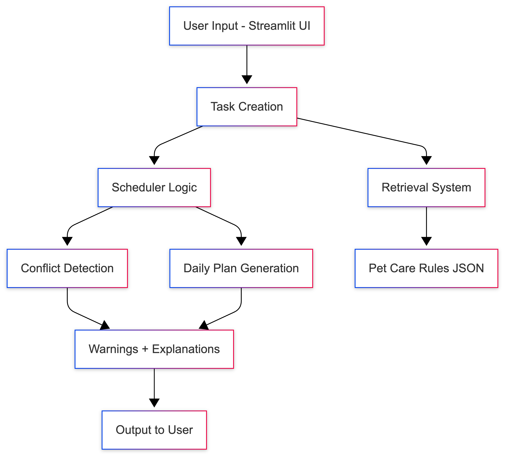

# PetFlow: Smart Pet Care Scheduling System

### Original Project (PawPal+)

This project builds on my earlier PawPal+ application, which was a pet care scheduling tool that allowed users to create and manage tasks for their pets. The original system focused on organizing tasks and generating a daily schedule based on time and priority.

### Project Overview

PetFlow is a pet care scheduling system that helps users organize daily and recurring tasks, detect scheduling conflicts, and receive helpful care suggestions. The system combines scheduling logic with a simple retrieval feature that provides pet care guidelines based on the task being added.

This project demonstrates how structured data and rule-based logic can improve user decision-making and make the system more reliable.

### Architecture Overview

PetFlow is built using a modular structure:

- **Streamlit UI (`app.py`)**: Handles user input and displays results  
- **Scheduler (`src/scheduler.py`)**: Manages tasks, generates schedules, and detects conflicts  
- **Retrieval System (`src/retrieval.py`)**: Looks up pet care guidelines  
- **Data (`data/pet_care_rules.json`)**: Stores pet care rules  

Flow:
User Input → Task Creation → Scheduler Logic → Retrieval → Output (schedule + warnings + tips)


### Setup Instructions

Clone the repository:
```bash
git clone https://github.com/Kimberlyyv/petflow.git
cd petflow

Install dependencies:
pip install -r requirements.txt

Run the app:
python -m streamlit run app.py

### Sample Interactions

Example 1: Adding a Task

Input: Dog → “walk” → 08:00
Output:
Task added
Care tip: Dogs need regular walks for exercise and health

Example 2: Conflict Detection

Input: Two tasks at 08:00
Output:
Warning explaining which tasks conflict and why

Example 3: Invalid Input

Input: Empty task title
Output:
Error message preventing submission

### Design Decisions
Used a simple JSON dataset for retrieval to keep the system lightweight and explainable
Separated logic into modules (scheduler, retrieval) for better organization
Prioritized clarity over complexity to ensure the system is easy to understand and maintain
Added guardrails (input validation) to improve reliability and prevent incorrect data

### Testing Summary
Tested task creation with valid and invalid inputs
Verified conflict detection by creating overlapping tasks
Confirmed retrieval system returns correct guidelines based on pet type and task
Guardrails successfully prevented empty inputs and incorrect time formats

### Reflection

One limitation of this system is that the retrieval feature relies on a small predefined dataset, so it may not cover all possible pet care scenarios. Additionally, the system assumes that user input is mostly accurate beyond basic validation.

The system could potentially be misused if users rely on it for critical pet care decisions without verifying the information. To reduce this risk, the system provides simple guidelines rather than authoritative advice.

While working on this project, I found that breaking the system into smaller components made debugging and improvements much easier. One helpful use of AI was generating structured logic ideas, while one limitation was that some suggestions required adjustments to fit the project’s design.

### Portfolio Reflection

This project shows my ability to take an initial prototype and turn it into a more structured and reliable system. It highlights my skills in Python, modular design, and building user-focused applications that incorporate data-driven logic.

### System Architecture


### UML Diagram


### Demo Video
(https://imgur.com/a/Jw8ixpu)